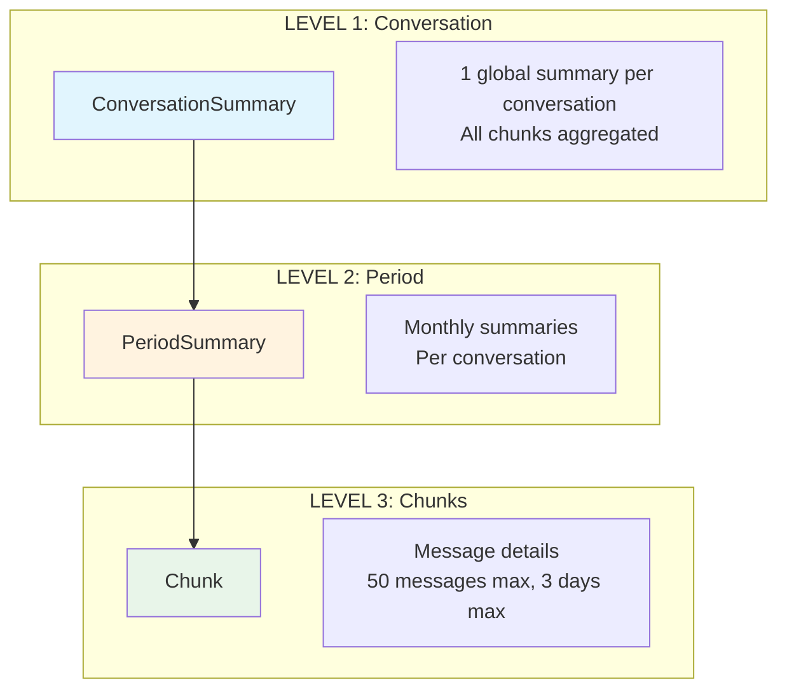
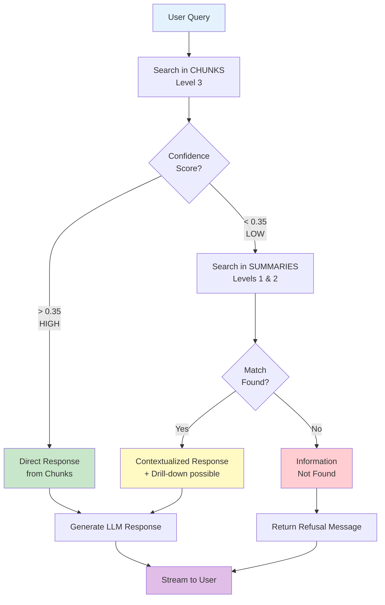
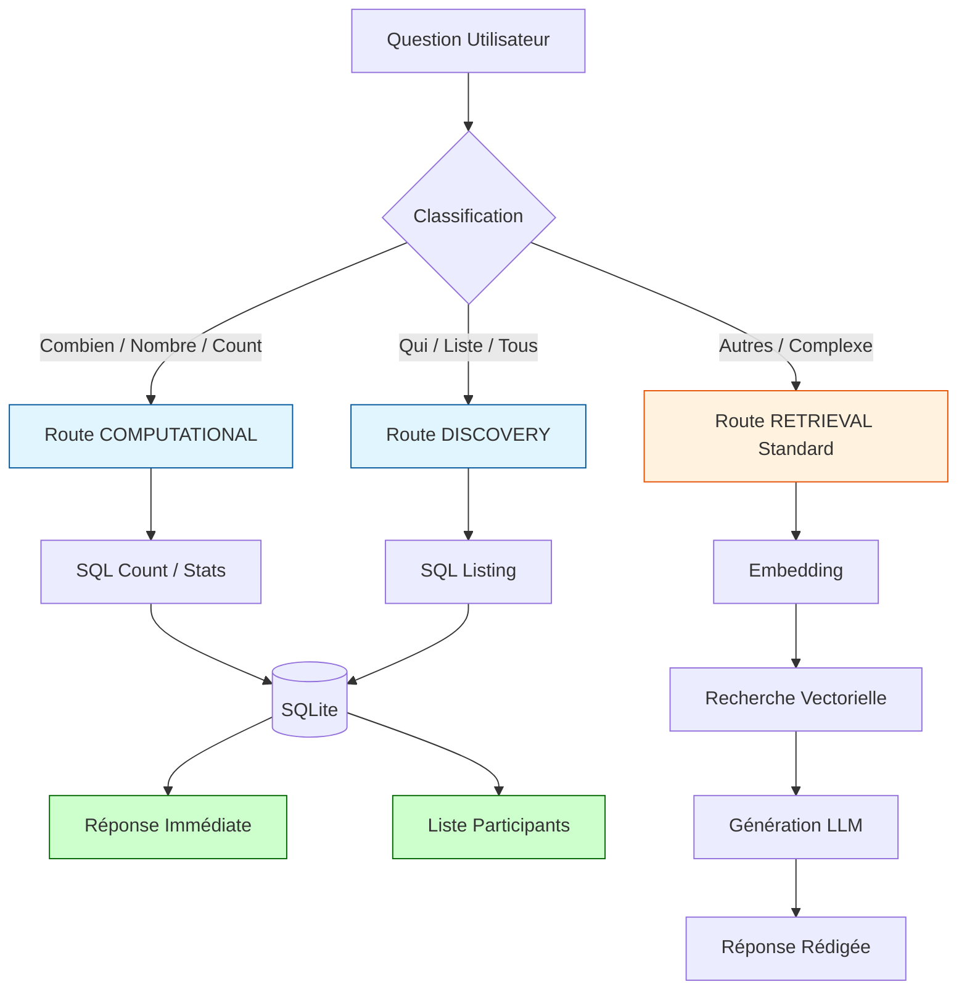
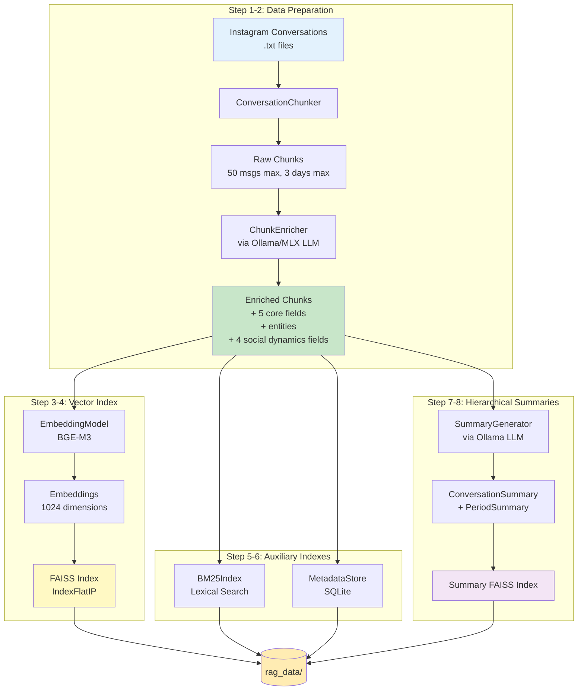
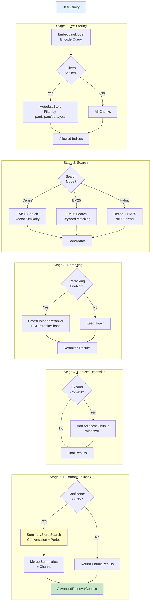
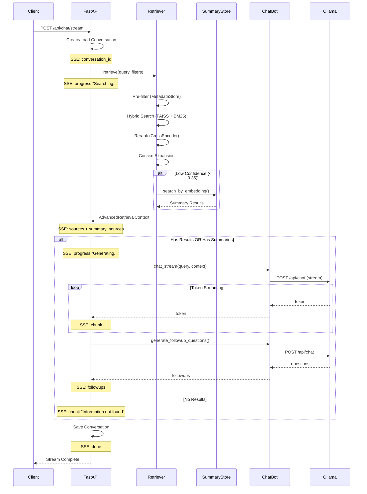

# Instagram Assistant - Features Documentation

This document describes the advanced features of the Instagram Assistant RAG system.

> For a concise end-to-end overview of the pipeline, see [RAG_PIPELINE.md](RAG_PIPELINE.md).

---

## Table of Contents

1. [LLM Enrichment](#1-llm-enrichment)
2. [Hierarchical Summaries](#2-hierarchical-summaries)
3. [Evaluation Pipeline](#3-evaluation-pipeline)
4. [Robustness & Confidence](#4-robustness--confidence)
5. [Incremental Updates](#5-incremental-updates)
6. [User Experience](#6-user-experience)
7. [Intelligent Query Routing](#7-intelligent-query-routing)

---

## 1. LLM Enrichment

The enrichment pipeline uses a local LLM (via Ollama) to generate semantic metadata for each chunk, dramatically improving retrieval quality.

### 1.1 Enriched Fields

Each chunk is enriched with 10 semantic fields organized into three categories:

**Core Semantic Fields (5)**

| Field | Type | Description |
|-------|------|-------------|
| `narrative_summary` | `string` | One-sentence summary of the exchange (action, intention, outcome) |
| `hypothetical_questions` | `string[]` | 1 to 5 questions this chunk directly answers (user-like phrasing) |
| `speaker_intents` | `Dict[str, str]` | Per-participant goals/objectives |
| `temporal_context` | `string` | Semantic period description (e.g., "during visa application") |
| `emotions` | `Dict` | Emotional analysis of the exchange (dominant, tone, tension_level) |

**Entity Extraction (1)**

| Field | Type | Description |
|-------|------|-------------|
| `entities` | `Dict[str, List[str]]` | Explicitly mentioned elements: `locations`, `people`, `media`, `events` |

**Social Dynamics (4)**

| Field | Type | Description |
|-------|------|-------------|
| `interaction_pattern` | `string \| null` | Type of exchange: "Planification", "Récit", "Débat", "Soutien", "Conflit", "Catch-up", or null if unclear |
| `initiative` | `string \| null` | Who leads the conversation (e.g., "Alice", "Équilibré", "Bob pose les questions") |
| `emotional_shift` | `string \| null` | Emotional trajectory (e.g., "Neutre → Joyeux", "Tendu → Apaisé", "Stable") |
| `open_loops` | `List[str] \| null` | Unresolved topics mentioned but not concluded |

### 1.2 Emotions Structure

The `emotions` field captures the emotional context with three dimensions:

```json
{
  "dominant": "joy|sadness|anger|fear|surprise|excitement|frustration|affection|worry|relief|...",
  "tone": "light|serious|playful|tense|intimate|formal|sarcastic|...",
  "tension_level": "low|medium|high"
}
```

**Use cases:**
- Query: "When were we arguing?" → matches chunks with `tension_level: high`
- Query: "Happy moments with X" → matches chunks with `dominant: joy`
- Query: "Serious discussions" → matches chunks with `tone: serious`

### 1.3 Entities Structure

The `entities` field extracts explicitly mentioned elements (no hallucination):

```json
{
  "locations": ["Paris", "Restaurant La Belle Époque"],
  "people": ["Marc", "Sophie"],
  "media": ["Inception", "Spotify playlist"],
  "events": ["Fête de Marie", "Réunion d'équipe"]
}
```

**Rules:**
- Only EXPLICITLY mentioned items from the text
- Empty arrays `[]` if no mentions in a category
- Never invented or inferred data

**Use cases:**
- Query: "Discussions about Paris" → matches chunks with `locations: ["Paris"]`
- Query: "When did we talk about Inception?" → matches chunks with `media: ["Inception"]`
- Query: "Conversations mentioning Marc" → matches chunks with `people: ["Marc"]`

### 1.4 Compact Content Representation

Before enrichment, chunks are converted to a compact format to save tokens and focus on content:

**Transformations:**
- Remove timestamps: `[2024-01-15 10:30]` → removed
- Shorten names: `"Lucie Dupont"` → `"Lucie"` or `"Lucie D."` (if collision with another Lucie)
- Handle name disambiguation automatically
- Preserve message structure: `Author: Message`

**Example:**
```
Original:
[2024-01-15 10:30:00] Marie Dubois: On se voit demain ?
[2024-01-15 10:31:15] Lucie Martin: Oui, 14h !

Compact:
Marie: On se voit demain ?
Lucie: Oui, 14h !
```

This compact format is used for:
- LLM enrichment analysis (reduces token usage)
- Embedding generation (via `get_compact_content()`)
- Preserves full content with timestamps in `chunk.content` for display

### 1.5 How Enrichment Works

Module: `rag_pipeline/enrichment/enricher.py`

```python
from rag_pipeline.enricher import ChunkEnricher

enricher = ChunkEnricher()

# Single chunk (returns 10 fields)
summary, questions, intents, temporal, entities, emotions, \
    interaction_pattern, initiative, emotional_shift, open_loops = enricher.enrich_chunk(chunk)

# Batch with progress
enricher.enrich_batch(
    chunks,
    progress_callback=lambda curr, total: print(f"{curr}/{total}"),
    save_callback=save_fn,
    save_interval=20
)
```

**LLM Provider Support:**
- Default: Ollama (`provider="ollama"`)
- Alternative: MLX for Apple Silicon (`provider="mlx"`)

```python
# Use MLX provider
enricher = ChunkEnricher(provider="mlx")
```

### 1.6 Embedding Priority

Enriched fields are prioritized in embeddings (`get_embedding_text()`):

1. **Hypothetical questions** (highest priority - semantic matching, budget-normalized repetition based on `max_questions`)
2. **Entities** (locations, people, media, events - repeated x2 each)
3. **Narrative summary** (repeated x2)
4. **Temporal context** (single pass)
5. **Speaker intents** (single pass per participant)
6. **Initiative** (social dynamics - single pass)
7. **Open loops** (unresolved topics - single pass per loop)
8. **Emotions** (ambiance - single pass)
9. **Interaction pattern** (exchange type - single pass)
10. **Emotional shift** (trajectory - single pass)
11. **Raw content** (compact version without timestamps, lowest priority)

This ordering ensures the embedding model focuses on semantic enrichments first, with entities and questions receiving the strongest signal boost.

**Tag Prefixes:**
Each field is prefixed with a semantic tag in embeddings:
- `[QUESTION]` for hypothetical questions
- `[ENTITY:category]` for entities (e.g., `[ENTITY:locations] Paris`)
- `[SUMMARY]` for narrative summary
- `[TIME]` for temporal context
- `[INTENT]` for speaker intents
- `[INITIATIVE]`, `[OPEN_LOOP]`, `[EMOTION]`, `[INTERACTION]`, `[EMOTIONAL_SHIFT]` for other fields
- `[CONTENT]` for raw conversation

### 1.7 Reranking Integration

The cross-encoder reranker uses core semantic fields for scoring (entities and social dynamics not included to avoid token budget issues):

```
Questions covered: [hypothetical questions]
Period: [temporal context]
Intents: [speaker intents]
Mood: [emotions summary]
Summary: [narrative summary]
[content excerpt - 900 chars]
```

**Note:** Entities and social dynamics fields are used in embeddings but not in reranking to keep input under the 512-token limit.

### 1.8 Configuration

```python
# In rag_pipeline/core/config.py or .env
LLM_MODEL=ministral-3:8b    # Ollama model for enrichment (default)
OLLAMA_URL=http://localhost:11434
MAX_QUESTIONS=5             # Max hypothetical questions per chunk
```

**LLM Parameters:**
- Temperature: `0.1` (low variance for factual extraction)
- Max tokens: `2048` (increased to accommodate all enrichment fields)
- Format: JSON (enforced via Ollama API)
- Content: Full chunk content (no truncation - 128k context available)
- Max questions: `5` (configurable via `MAX_QUESTIONS` env var)

### 1.9 Re-enriching Existing Data

To add new fields to already-enriched chunks:

```python
# Force re-enrichment by clearing specific fields
for chunk in chunks:
    chunk.entities = None  # Add entities
    chunk.interaction_pattern = None  # Add social dynamics
    chunk.initiative = None
    chunk.emotional_shift = None
    chunk.open_loops = None
    # Or clear all: chunk.narrative_summary = None

enricher.enrich_batch(chunks, ...)
```

Or run a full reindex:
```bash
python setup_rag_batch.py
```

---

## 2. Hierarchical Summaries

The hierarchical summaries feature adds a layer of abstraction above chunks to handle "big picture" queries like:
- "De quoi a-t-on parlé avec Marie cet été ?"
- "Résume mes conversations avec Paul"
- "Quels sujets reviennent souvent avec ce groupe ?"

### 2.1 Architecture



### 2.2 Data Models

Module: `rag_pipeline/summaries/summary_models.py`

#### ConversationSummary

Global summary of an entire conversation with a participant.

| Field | Type | Description |
|-------|------|-------------|
| `summary_id` | `string` | `{conversation_id}_summary` |
| `conversation_id` | `string` | Reference to the conversation |
| `participants` | `string[]` | List of participants |
| `date_start` | `string` | First message date (ISO) |
| `date_end` | `string` | Last message date (ISO) |
| `total_messages` | `int` | Total message count |
| `total_chunks` | `int` | Total chunk count |
| `summary` | `string` | Narrative summary (2-3 sentences) |
| `main_topics` | `string[]` | 3-5 recurring topics |
| `relationship_dynamic` | `string` | Type of relationship (friends, family, colleagues...) |
| `notable_events` | `string[]` | Notable events mentioned |
| `chunk_ids` | `string[]` | Linked chunk IDs |

#### PeriodSummary

Summary of a specific month for a conversation.

| Field | Type | Description |
|-------|------|-------------|
| `summary_id` | `string` | `{conversation_id}_period_{YYYY-MM}` |
| `conversation_id` | `string` | Reference to the conversation |
| `participants` | `string[]` | List of participants |
| `period` | `string` | Period in `YYYY-MM` format |
| `date_start` | `string` | First message date of period |
| `date_end` | `string` | Last message date of period |
| `message_count` | `int` | Message count for this period |
| `summary` | `string` | Period summary (1-2 sentences) |
| `topics` | `string[]` | 2-3 topics discussed |
| `mood` | `string` | General mood (light, serious, tense, joyful...) |
| `chunk_ids` | `string[]` | Chunk IDs in this period |

### 2.3 Retrieval with Automatic Fallback



### 2.4 Usage

#### Generating Summaries

Summaries are generated automatically during indexing:

```bash
python setup_rag_batch.py
```

Steps 7 and 8 handle summary generation and indexing:
- **Step 7**: Generate hierarchical summaries via LLM
- **Step 8**: Build FAISS index for summaries

#### Manual Generation

```python
from rag_pipeline.summary_generator import SummaryGenerator
from rag_pipeline.summary_store import SummaryStore
from rag_pipeline.chunker import ConversationChunker
from rag_pipeline.config import Config

config = Config()
chunker = ConversationChunker(config)
chunks = chunker.load_chunks()

# Generate summaries
generator = SummaryGenerator(config)
conv_summaries, period_summaries = generator.generate_all_summaries(chunks)

# Build and save index
from rag_pipeline.embeddings import EmbeddingModel
embedding_model = EmbeddingModel(config)
store = SummaryStore(config, embedding_model)
store.build_indexes(conv_summaries, period_summaries)
store.save()
```

#### Searching Summaries Directly

```python
from rag_pipeline.summary_store import SummaryStore
from rag_pipeline.embeddings import EmbeddingModel
from rag_pipeline.config import Config

config = Config()
embedding_model = EmbeddingModel(config)

store = SummaryStore(config, embedding_model)
store.load()

# Search all levels
results = store.search("De quoi on a parlé avec Marie ?", level="all", top_k=3)

# Search only conversation summaries
results = store.search("Résume mes échanges avec Paul", level="conversation", top_k=3)

# Search only period summaries
results = store.search("Que s'est-il passé en juin ?", level="period", top_k=3)

# Display results
for result in results:
    print(f"[{result.level}] Score: {result.score:.2f}")
    print(f"  {result.summary.summary}")
```

### 2.5 Configuration

```python
# In rag_pipeline/core/config.py or .env

# Retrieval settings
top_k: int = 12  # Number of chunks to retrieve (default)

# Threshold to trigger fallback to summaries
fallback_threshold: float = 0.35

# Weight for summary results in final score
summary_boost: float = 0.8
```

### 2.6 Generated Files

After running `setup_rag_batch.py`, the following files are created:

```
rag_data/
├── conversation_summaries.json    # ConversationSummary data
├── period_summaries.json          # PeriodSummary data
└── summary_index/
    ├── conversation_index.faiss   # FAISS index for conversations
    └── period_index.faiss         # FAISS index for periods
```

### 2.7 Integration with Advanced Retriever

The `AdvancedRetriever` automatically uses the summary store when configured:

```python
from rag_pipeline.advanced_retriever import create_advanced_retriever

# Factory function now includes summary store
retriever, components = create_advanced_retriever(
    enable_reranking=True,
    enable_bm25=True,
    enable_metadata=True,
    enable_summaries=True  # Enable hierarchical summaries fallback
)

# Retrieve with automatic fallback
context = retriever.retrieve("De quoi a-t-on parlé avec Marie cet été ?")

# Check if summary fallback was used
if context.used_summary_fallback:
    print("Summary fallback was triggered")
    for sr in context.summary_results:
        print(f"  [{sr.level}] {sr.summary.summary}")
```

---

## 3. Evaluation Pipeline

The evaluation pipeline enables automated measurement and comparison of RAG system performance.

### 3.1 Synthetic Data Generation

Module: `eval/synthetic_generator.py`

Automatically generates question-answer pairs from indexed chunks using an LLM.

#### Question Types

| Type | Description | Example |
|------|-------------|---------|
| `factual` | Direct information extraction | "When did you discuss X?" |
| `summary` | Synthesis question | "What did you discuss in January?" |
| `implicit` | Light inference | "What was the mood of this conversation?" |
| `temporal` | Time-based questions | "When did you plan Y?" |

#### Difficulty Levels

- `EASY`: Simple fact retrieval
- `MEDIUM`: Requires connecting information
- `HARD`: Requires inference or synthesis

#### Usage

```python
from eval.core import SyntheticDataGenerator

generator = SyntheticDataGenerator()
qa_pairs = generator.generate_dataset(chunks, target_size=50)
generator.save_dataset(qa_pairs)
```

### 3.2 RAGAS Metrics

Module: `eval/core/metrics.py`

Implements RAGAS-inspired metrics for RAG evaluation:

| Metric | Description | Range |
|--------|-------------|-------|
| **Retrieval Accuracy** | Is correct chunk in top-k? | 0-100% |
| **MRR** (Mean Reciprocal Rank) | Average reciprocal rank | 0-1 |
| **Faithfulness** | Is answer faithful to sources? (LLM-as-judge) | 0-1 |
| **Answer Relevance** | Does answer address the question? (LLM-as-judge) | 0-1 |

Metrics are broken down by question type and difficulty level.

### 3.3 Benchmark Runner

Module: `eval/benchmark.py`

Compare different RAG configurations:

```python
from eval.core import BenchmarkRunner, BenchmarkConfig

runner = BenchmarkRunner()

config = BenchmarkConfig(
    name="full_pipeline",
    use_query_rewriting=True,
    use_reranking=True,
    use_hybrid=True,
    use_context_expansion=True,
    top_k=12
)

report = runner.run_benchmark(qa_pairs, config)
print(report.summary())
```

### 3.4 CLI Evaluation

```bash
# Generate 50 QA pairs
python -m eval.run_eval --generate 50

# Run benchmark
python -m eval.run_eval --benchmark

# Compare configurations (full, no_reranking, no_hybrid, minimal)
python -m eval.run_eval --compare
```

#### Example Output

```
=== Benchmark Report: full ===
Total questions: 50

Retrieval Metrics:
  Accuracy (Hit@k): 82.0%
  MRR: 0.756
  Avg Rank: 1.45

Generation Metrics:
  Faithfulness: 87.5%
  Relevance: 91.2%
```

---

## 4. Robustness & Confidence

### 4.1 Confidence Thresholds

The system can refuse to answer if confidence is too low.

#### Configuration

```python
# In rag_pipeline/core/config.py
confidence_threshold: float = 0.25  # Minimum required score
```

#### Behavior

- If `max_score < confidence_threshold`: Returns refusal message
- `low_confidence` flag added to retrieval context
- Web interface displays warning badge

### 4.2 Anti-Hallucination Prompt

The system prompt enforces strict truthfulness rules:

```
STRICT TRUTH RULES:

1. ABSOLUTE TRUTHFULNESS - Answer ONLY from provided documents
2. Mandatory refusal formulas:
   - "I did not find this information..."
   - "The provided documents do not contain..."
3. Cite sources with number and date
4. Protect personal data
5. Off-topic questions: polite refusal
```

### 4.3 PII Filtering

Module: `rag_pipeline/chat/pii_filter.py`

Detects and masks personal information in responses.

#### Detected PII Types

| Type | Pattern | Mask |
|------|---------|------|
| French Phone | `06 12 34 56 78`, `+33...` | `[PHONE MASKED]` |
| Email | `user@domain.com` | `[EMAIL MASKED]` |
| IBAN | `FR76 3000 6000...` | `[IBAN MASKED]` |
| Credit Card | `4111 1111 1111 1111` | `[CARD MASKED]` |
| Address | `12 rue de Paris, 75001` | `[ADDRESS MASKED]` |
| French SSN | `1 85 12 75 115...` | `[SSN MASKED]` |

#### Usage

```python
from rag_pipeline.pii_filter import PIIFilter

filter = PIIFilter()

# Detect PII
matches = filter.detect(text)

# Mask PII
masked_text, matches = filter.mask(text)

# Check for PII
has_pii = filter.has_pii(text)
```

#### Enable/Disable

```python
# In rag_pipeline/core/config.py
enable_pii_filter: bool = True
```

---

## 5. Incremental Updates

### 5.1 Delta Tracker

Module: `rag_pipeline/indexing/delta_tracker.py`

Tracks file changes using SHA256 hashing.

#### How It Works

1. **SHA256 hash** of each indexed file
2. **Change detection**:
   - New files (not tracked)
   - Modified files (hash changed)
   - Deleted files (tracked but missing)

#### Persistent State

State saved in `rag_data/file_state.json`:

```json
{
  "last_updated": "2024-01-15T10:30:00",
  "total_files": 42,
  "files": {
    "/path/to/conversation.txt": {
      "content_hash": "abc123...",
      "last_modified": "2024-01-15T09:00:00",
      "last_indexed": "2024-01-15T10:00:00",
      "chunk_ids": ["conv_chunk_000", "conv_chunk_001"],
      "file_size": 15234
    }
  }
}
```

### 5.2 Incremental Vector Store

Module: `rag_pipeline/indexing/vector_store.py`

New methods for incremental updates:

```python
# Add vectors
vector_store.add_vectors(new_chunks, new_embeddings)

# Remove vectors by chunk_id
vector_store.remove_vectors(["chunk_001", "chunk_002"])

# Combined update (remove + add)
removed, added = vector_store.update_vectors(
    chunk_ids_to_remove=["old_chunk"],
    new_chunks=[new_chunk],
    new_embeddings=embeddings
)
```

### 5.3 Update Script

```bash
# Show status (detected changes)
python scripts/maintenance/update_index.py --status

# Run incremental update
python scripts/maintenance/update_index.py

python scripts/maintenance/update_index.py --full
```

#### Example Output

```
============================================================
Incremental Index Update
============================================================

Changes detected: New: 2, Modified: 1, Deleted: 0

Loading components...
Removing 15 old chunks...

Processing 3 files...
  [1/3] new_conversation.txt
  [2/3] updated_conversation.txt
  [3/3] another_new.txt

Enriching 45 chunks...

Generating embeddings for 45 chunks...
  [45/45] Done

Saving vector store...
Rebuilding BM25 index...
Rebuilding metadata index...
Saving tracker state...

============================================================
Update Complete
============================================================
Total chunks in index: 1250
Tracked files: 44
```

---

## 6. User Experience

### 6.1 Interactive Citations

Sources are clickable and display a modal with full content.

#### API Endpoint

```
GET /api/chunks/{chunk_id}
```

**Response**:
```json
{
  "chunk_id": "conv_chunk_001",
  "content": "...",
  "narrative_summary": "Alice and Bob discuss travel plans...",
  "participants": ["Alice", "Bob"],
  "date_start": "2024-01-15 10:00:00",
  "date_end": "2024-01-15 12:30:00",
  "file_source": "conversation_alice.txt",
  "message_count": 45,
  "hypothetical_questions": [
    "When did Alice and Bob discuss travel plans?",
    "What destinations were mentioned?"
  ],
  "entities": {
    "locations": ["Paris", "Lyon"],
    "people": ["Marc"],
    "media": [],
    "events": ["Weekend trip"]
  },
  "emotions": {
    "dominant": "excitement",
    "tone": "playful",
    "tension_level": "low"
  },
  "interaction_pattern": "Planification",
  "initiative": "Alice leads",
  "emotional_shift": "Neutre → Excité",
  "open_loops": ["Hotel reservation pending"]
}
```

#### Interface

- Click on source → Modal with full content
- Display: narrative summary, metadata, hypothetical questions, entities, emotions, social dynamics
- Raw conversation content

### 6.2 Follow-up Questions

System automatically generates 3 follow-up questions after each answer.

#### SSE Event

```json
{"type": "followups", "questions": [
  "Do you have other conversations on this topic?",
  "When did you discuss X again?",
  "Who else participated in this discussion?"
]}
```

#### Interface

- Clickable buttons below answer
- Click → Fills input field and submits automatically

### 6.3 Progress Indicators

Streaming now includes progress events:

| Step | Message |
|------|---------|
| `search` | "Searching..." |
| `documents` | "Reading N documents..." |
| `generating` | "Generating response..." |
| `followups` | "Preparing suggestions..." |

#### SSE Event

```json
{"type": "progress", "step": "documents", "message": "Reading 5 documents...", "count": 5}
```

### 6.4 Low Confidence Handling

When confidence score is too low:

1. No LLM call made
2. Immediate message: "I did not find relevant information..."
3. `low_confidence` badge in response metadata

---

## 7. Intelligent Query Routing

The system uses a rule-based classifier to route queries to the most efficient processing path, bypassing the heavy RAG pipeline for simple statistics or discovery questions.

### 7.1 Routing Logic



### 7.2 Routing Types

| Type | Description | Keywords |
|------|-------------|----------|
| `COMPUTATIONAL` | Counting and statistics via direct SQL. | `combien`, `nombre`, `count`, `total` |
| `DISCOVERY` | Listing participants or topics via SQL. | `qui`, `liste`, `tous`, `participants` |
| `RETRIEVAL` | Standard RAG flow for complex questions. | (Default) |

---

## Architecture

```
instagram-assistant/
├── eval/
│   ├── synthetic_generator.py   # QA generation
│   ├── metrics.py               # RAGAS metrics
│   ├── benchmark.py             # Benchmark runner
│   └── run_eval.py              # CLI
├── rag_pipeline/
│   ├── config.py                # + confidence_threshold, enable_pii_filter, fallback_threshold
│   ├── advanced_retriever.py    # + low_confidence, max_confidence_score, summary fallback
│   ├── chat.py                  # + followup, PII filter
│   ├── vector_store.py          # + add/remove/update vectors
│   ├── pii_filter.py            # PII filtering
│   ├── delta_tracker.py         # File tracking
│   ├── summary_models.py        # NEW: ConversationSummary, PeriodSummary dataclasses
│   ├── summary_generator.py     # NEW: LLM-based summary generation
│   └── summary_store.py         # NEW: FAISS index for summaries
├── rag_data/
│   ├── faiss_index/             # Vector store (dense search)
│   ├── bm25_index.pkl           # Lexical index (keyword search)
│   ├── metadata.db              # SQLite (metadata filtering)
│   ├── conversation_summaries.json  # NEW: Conversation summaries data
│   ├── period_summaries.json    # NEW: Period summaries data
│   └── summary_index/           # NEW: FAISS indexes for summaries
│       ├── conversation_index.faiss
│       └── period_index.faiss
├── frontend/                    # React Application
│   ├── src/
│   │   ├── components/          # UI Components
│   │   ├── routes/              # Pages (Analytics, Chat...)
│   │   └── lib/                 # API client & utils
│   └── package.json
├── scripts/maintenance/update_index.py              # Incremental update script
└── docs/
    └── FEATURES.md              # This documentation
```

---

## RAG Pipeline Diagrams

### Indexing Pipeline (setup_rag_batch.py)



### Retrieval Pipeline (AdvancedRetriever)



### API Chat Flow (app.py /api/chat/stream)



---

## FAQ

### How to disable PII filtering?

```python
# In config.py or at instantiation
config.enable_pii_filter = False
```

### How to adjust confidence threshold?

```python
# Stricter (refuses more often)
config.confidence_threshold = 0.4

# More permissive
config.confidence_threshold = 0.15
```

### Incremental update doesn't detect changes?

Verify:
1. Files are in `instagram_conversations/`
2. Extension is `.txt`
3. Content actually changed (not just date)

### How to force full rebuild?

```bash
python scripts/maintenance/update_index.py --full
```

Or delete `rag_data/file_state.json` then run `python scripts/maintenance/update_index.py`.